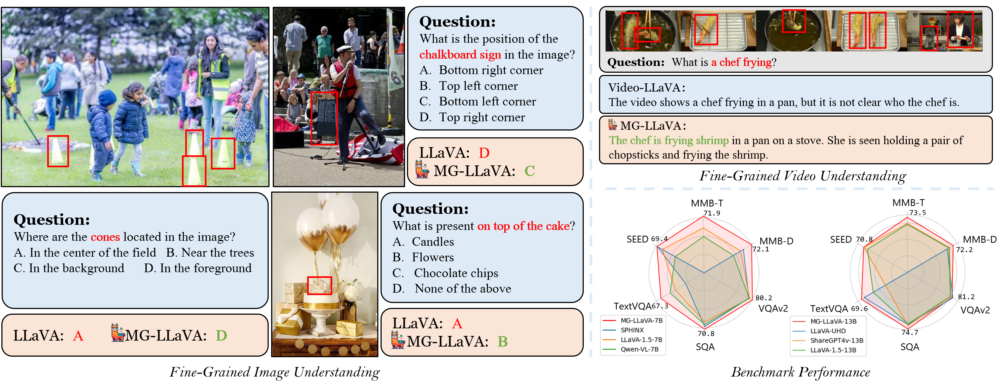
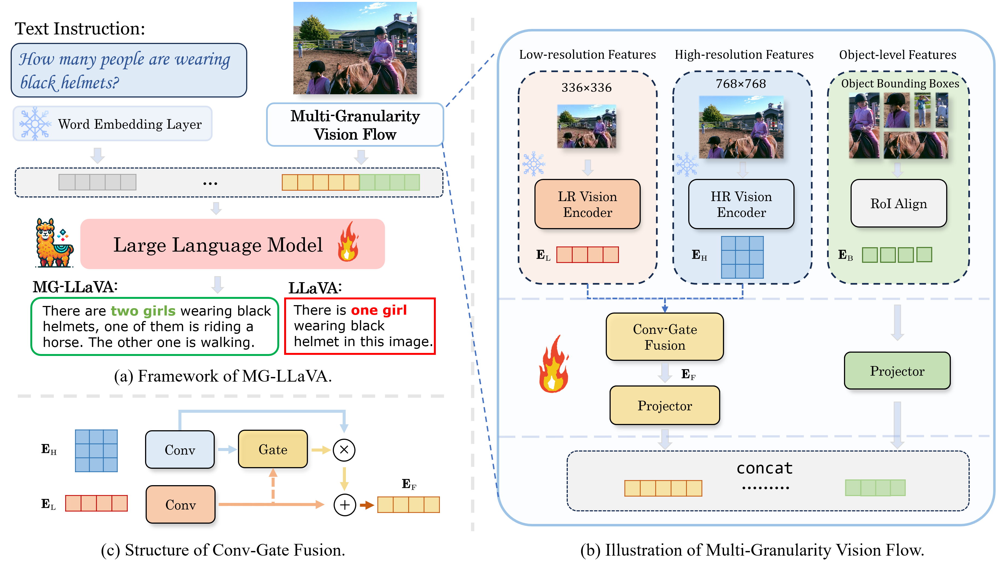
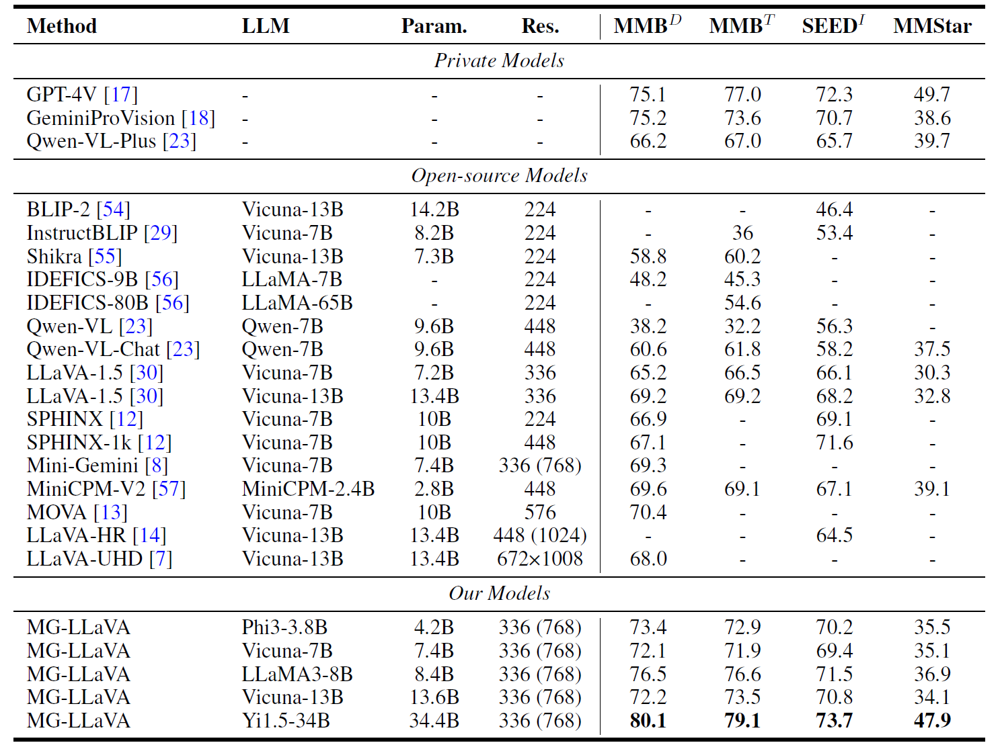

<div align="center">
  
</div>

# MG-LLaVA: Towards Multi-Granularity Visual Instruction Tuning

 Xiangyu Zhao, [Xiangtai Li](https://lxtgh.github.io), [Haodong Duan](https://kennymckormick.github.io/), [Haian Huang](https://github.com/hhaAndroid), [Yining Li](https://scholar.google.com.hk/citations?user=y_cp1sUAAAAJ&hl=en), [Kai Chen](https://scholar.google.com.hk/citations?user=eGD0b7IAAAAJ&hl=en), Hua Yang

  <p align="center">
    <a href='https://arxiv.org/abs/2406.17770'>
      
    </a>
    <a href='https://phoenixz810.github.io/MGLLaVA/'>
      
    </a>
    <a href='https://www.youtube.com/watch?v=WI-65Jk0j50'>
      
    </a>
  </p>
<br />
<div align="center">
  
</div>

## 🎉 News

- **\[2024/06\]** Our [paper](https://arxiv.org/abs/2406.17770), [code](https://github.com/PhoenixZ810/MG-LLaVA) and [weights](https://huggingface.co/PhoenixZ/MG-LLaVA) are all released.

## 📖 Introduction

we present MG-LLaVA, an innovative MLLM that enhances the model's visual processing capabilities by incorporating a multi-granularity vision flow, which includes low-resolution, high-resolution, and object-centric features. We propose the integration of an additional high-resolution visual encoder to capture fine-grained details, which are then fused with base visual features through a Conv-Gate fusion network. To further refine the model's object recognition abilities, we incorporate object-level features derived from bounding boxes identified by offline detectors. Being trained solely on publicly available multimodal data through instruction tuning,
MG-LLaVA demonstrates exceptional perception skills.

<div align="center">
  
</div>

## 🔥 Main Results
<div align="center">
  
</div>


## 🛠️ Quick Start

### Installation

- It is recommended to build a Python-3.10 virtual environment using conda

  ```bash
  conda create --name mgllava-env python=3.10 -y
  conda activate mgllava-env
  ```

- Install XTuner from source

  ```shell
  git clone https://github.com/PhoenixZ810/MG-LLaVA.git
  cd MG-LLaVA
  pip install -e '.[all]'
  ```

### Data Preparation

Please refer to [dataset_prepare.md](dataset_prepare.md).

### Before Train
MG-LLaVA employed several LLMs ranged from 3.8B to 34B, including [Phi-3-3.8B](https://huggingface.co/microsoft/Phi-3-mini-4k-instruct), [Vicuna1.5-7B](https://huggingface.co/lmsys/vicuna-7b-v1.5), [Vicuna1.5-13B](https://huggingface.co/lmsys/vicuna-13b-v1.5), [llama3-8B](https://huggingface.co/meta-llama/Meta-Llama-3-8B-Instruct), and [Yi1.5-34B](https://huggingface.co/01-ai/Yi-1.5-34B-Chat). We employ [CLIP-Large-336](https://huggingface.co/openai/clip-vit-large-patch14-336) and [CLIP-ConvNext-320-d](https://huggingface.co/laion/CLIP-convnext_large_d_320.laion2B-s29B-b131K-ft-soup) as vision encoders, you should download both the LLM and CLIP checkpoints before training.

The training process is similar to the original XTuner. Before training, you should check the [configs](mg_llava/config) and modify the following variables to your own settings. You can also modify the [configs](mg_llava/config) to train the model with your own settings.
  ```shell
  # Path of LLM and CLIP
  llm_name_or_path
  visual_encoder_name_or_path
  visual_encoder_aux_path
  prompt_template

  # Data
  data_path
  box_json_path
  image_folder
  offline_processed_text_folder(optional)

  # Training
  pretrained_pth(Fine-Tuning)
  ```
Before training, you can use the following command to preprocess the text data to speed up the training process. You can preprocess the text data by running the following command:

```shell
python xtuner/tools/process_untokenized_llava_data.py CONFIG --save-folder TEXT-PATH
```
and then set the `offline_processed_text_folder` in the config file to `TEXT-PATH`.

### Train & Evaluation
MG-LLaVA follows a two-stage training process, the entire training process takes approximately 23 hours when using the Vicuna1.5-7B model using 8×A100 GPUs. For example, to train the MG-LLaVA model with Vicuna1.5-7B, you can use the following command:


- **Entire Pipeline**: Pretraining + Fine-tuning + Evaluation

  ```shell
  bash script/train_vicuna7B.sh
  ```

If you want to train our model step by step, you can follow the instructions below:

- **Step 1**, start pretraining.
  ```shell
  bash script/train_pretrain.sh mg_llava/config/vicuna/fuse_vicuna7b_clip_L_14_336_pretrain_padding.py
  ```

- **Step 2**, start fine-tuning.

  ```shell
  bash script/train_sft.sh mg_llava/config/vicuna/fuse_vicuna7b_clip_L_14_336_sft_padding.py
  ```

  - `--deepspeed` means using [DeepSpeed](https://github.com/microsoft/DeepSpeed) 🚀 to optimize the training. XTuner comes with several integrated strategies including ZeRO-1, ZeRO-2, and ZeRO-3. If you wish to disable this feature, simply remove this argument.

  - For more examples, please see [finetune.md](./docs/en/user_guides/finetune.md).

- **Step 3**, evaluation. The evaluation metrics are specified in the sft configuration, including MMBench, SEED, SQA, AI2D, TextVQA, POPE, GQA, VQAv2, and additional ones. For example, in the [Vicuna7B-sft config](mg_llava/config/vicuna/fuse_more_vicuna7b_clip_L_14_336_sft_padding.py):

  ```
  test_dataset = [
      dict(
          type=MultipleChoiceDataset,
          proxy_eval_dataset=dict(
              type=MGLLaVAProxyEvalDataset,
              box_json_path='PATH_TO_MMB-TEST_BBOX_JSON',
              image_size_aux=image_size_aux,
              limit_num=limit_num,
          ),
          data_file='PATH_TO_MMB-DEV_TSV',
          prompt_template=PROMPT_TEMPLATE.vicuna,
          tokenizer=tokenizer,
          image_processor=image_processor,
          pad_image_to_square=pad_image_to_square,
      ),
      dict(
          type=TextVQADataset,
          proxy_eval_dataset=dict(
              type=MGLLaVAProxyEvalDataset,
              box_json_path='PATH_TO_TEXTVQA-VAL_BBOX_JSON',
              image_size_aux=image_size_aux,
              limit_num=limit_num,
          ),
          data_file='textvqa/llava_textvqa_val_v051_ocr.jsonl',
          ann_file='text_vqa/TextVQA_0.5.1_val.json',
          image_folder='text_vqa/train_images',
          prompt_template=PROMPT_TEMPLATE.vicuna,
          tokenizer=tokenizer,
          image_processor=image_processor,
          pad_image_to_square=pad_image_to_square,
      ),
      dict(
          type=MMEDataset,
          proxy_eval_dataset=dict(
              type=MGLLaVAProxyEvalDataset,
              box_json_path='PATH_TO_MME_BBOX_JSON',
              image_size_aux=image_size_aux,
              limit_num=limit_num,
          ),
          data_file='PATH_TO_MME_TSV',
          image_folder='/mnt/petrelfs/share_data/duanhaodong/data/mme/MME_Benchmark_release',
          prompt_template=PROMPT_TEMPLATE.vicuna,
          tokenizer=tokenizer,
          image_processor=image_processor,

          pad_image_to_square=pad_image_to_square,
      ),
      dict(
          type=POPEDataset,
          proxy_eval_dataset=dict(
              type=MGLLaVAProxyEvalDataset,
              box_json_path='PATH_TO_COCO-POPE_BBOX_JSON',
              image_size_aux=image_size_aux,
              limit_num=limit_num,
          ),
          data_file=[
              'POPE/coco_pope_adversarial.json',
              'POPE/coco_pope_popular.json',
              'POPE/coco_pope_random.json',
          ],
          coco_val_path='coco/val2014/',
          prompt_template=PROMPT_TEMPLATE.vicuna,
          tokenizer=tokenizer,
          image_processor=image_processor,
          pad_image_to_square=pad_image_to_square,
      ),
      dict(
          type=GQADataset,
          proxy_eval_dataset=dict(
              type=MGLLaVAProxyEvalDataset,
              box_json_path='PATH_TO_GQA_BBOX_JSON',
              image_size_aux=image_size_aux,
              limit_num=limit_num,
          ),
          question_file='gqa/llava_gqa_testdev_balanced.jsonl',
          answer_file='llava_gqa_testdev_balanced_merge.jsonl', # file name of predicted answer
          prediction_file='testdev_balanced_predictions.json', # file name of formatted predicted answer
          test_question_file='gqa/testdev_balanced_questions.json',
          image_folder='gqa/images',
          prompt_template=PROMPT_TEMPLATE.vicuna,
          tokenizer=tokenizer,
          image_processor=image_processor,
          pad_image_to_square=pad_image_to_square,
      ),
      dict(
          type=VQAv2Dataset,
          proxy_eval_dataset=dict(
              type=MGLLaVAProxyEvalDataset,
              box_json_path='PATH_TO_VQA_BBOX_JSON',
              image_size_aux=image_size_aux,
          ),
          question_file='vqa/llava_vqav2_mscoco_test-dev2015.jsonl',
          answer_file='llava_vqav2_testdev_balanced_merge.jsonl', # file name of predicted answer
          test_file='vqa/llava_vqav2_mscoco_test2015.jsonl',
          prediction_file='vqav2_testdev_balanced_predictions.json', # file name of formatted predicted answer
          image_folder='vqa/vqav2_test2015',
          prompt_template=PROMPT_TEMPLATE.vicuna,
          tokenizer=tokenizer,
          image_processor=image_processor,
          pad_image_to_square=pad_image_to_square,
      ),
  ]
  ```

Before evaluation, you should modify the [test config](script/test.sh). Then run the following command:
  ```shell
  bash script/test.sh
  ```
  You can convert the saved PTH model (if using DeepSpeed, it will be a directory) to Hugging Face model, by

  ```shell
  xtuner convert pth_to_hf CONFIG_NAME_OR_PATH CHECKPOINT SAVE_PATH
  ```

## Model Weights
Our checkpoints are available at [ModelZoo](https://huggingface.co/PhoenixZ/MG-LLaVA).

## Citation
If you find MG-LLaVA useful, please cite using this BibTeX:
```bibtex
@article{zhao2024mg,
  title={MG-LLaVA: Towards Multi-Granularity Visual Instruction Tuning},
  author={Zhao, Xiangyu and Li, Xiangtai and Duan, Haodong and Huang, Haian and Li, Yining and Chen, Kai and Yang, Hua},
  journal={arXiv preprint arXiv:2406.17770},
  year={2024}
}
```
## Acknowledgement
- [Xtuner](https://github.com/InternLM/xtuner): the codebase we built upon.
- [LLaVA](https://github.com/haotian-liu/LLaVA): the base model structure.


